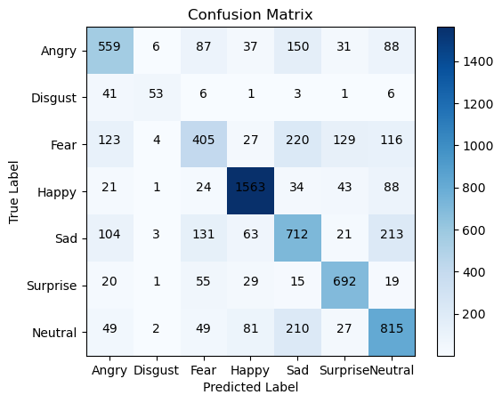

# Emotion-Recognition-from-Facial-Expressions
This repository contains the code and research paper for the project on Emotion Recognition from facial expressions. In this project, different machine learning models were explored to recognize emotions from facial expressions. The aim is to improve human-computer interaction and explore various approaches to achieve accurate emotion recognition.

## Dataset
1. https://www.kaggle.com/competitions/challenges-in-representation-learning-facial-expression-recognition-challenge/data
This is in the form of csv
2. https://www.kaggle.com/datasets/msambare/fer2013
This is in the form of grayscale images

## Key features
- **Multi-Modal Approach**: Integrates SVM, Logistic Regression, and CNN for robust emotion recognition.
- **Diverse Feature Extraction**: Leverages Bag of Visual Words, pixel values, and CNN layers.
- **Optimized Performance**: Rigorous hyperparameter tuning enhances model accuracy.
- **Data Enhancement**: Preprocessing and augmentation ensure models learn from comprehensive data.
- **Comprehensive Evaluation**: Detailed analysis includes accuracy metrics, confusion matrices, and benchmarking.
- **Proprietary CNN Model**: Tailored VGG16 architecture achieves 66.9% accuracy on FER2013 dataset.

## Methodology
- Three classification approaches were implemented: Support Vector Machines, Logistic Regression, and Convolutional Neural Networks.
- For SVM, bag-of-visual-words and histograms of descriptors were utilized as features. Also, hyper-parameter tuning was performed to obtain the best-performing model using rbf kernel.
-  Logistic Regression leverages pixel normalization. Here, hyperparameter tuning was performed using GridSearchCV.
-   In CNN, a pre-trained VGG16 model was experimented and a new hybrid model was proposed. The hybrid CNN model achieved the highest accuracy of 66.9%, surpassing SVM and Logistic Regression.

## Results
- **CNN Model**: Accuracy-66.9%
- **Logistic Regression model**: accuracy-38.35%
- **SVM**: accuracy- 25.69%

## Usage Instructions
1. Clone this repository using: git clone 'git@github.com:udayraghuvanshi03/Emotion-Recognition-from-Facial-Expressions.git'
2. **emotion_recognition_svm.py, extract_images_from_csv.py**
- After downloading the above dataset, store all the training images in one folder (All_train_images) and all test images in another folder (All_test_images). If using just csv files, extract_images_from_csv.py can be used to extract images from csv and store in respective folders.
- It forms arrays of training and test label from csv using pandas.
- Run the program
3. **emotion_recognition_LR.py**
- After downloading the 2nd dataset(grayscale images) extract the files
- Specify the path to test and train data in the final_LR.py file at line 40-41.
- Run the program
4. **VGG1_CNNfer2013.ipynb, VGG2_CNNfer2013_pretrain.ipynb**
- VGG1_CNNfer2013.ipynb is the Jupyter notebook implementation of proposed CNN network and VGG2_CNNfer2013_pretrain.ipynb is the Jupyter notebook implementation of pre-trained VGG16 network
- After downloading the dataset, provide the absolute path of train.csv and test.csv files in the code
- Run the program

